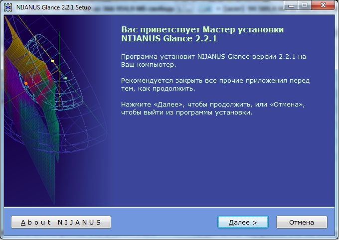
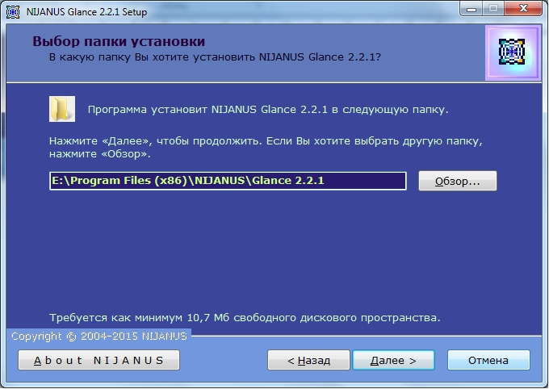
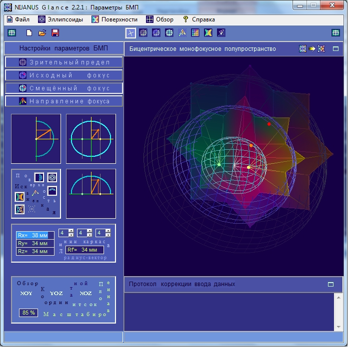
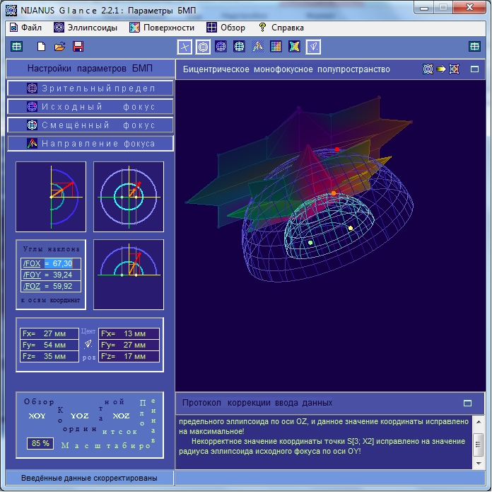
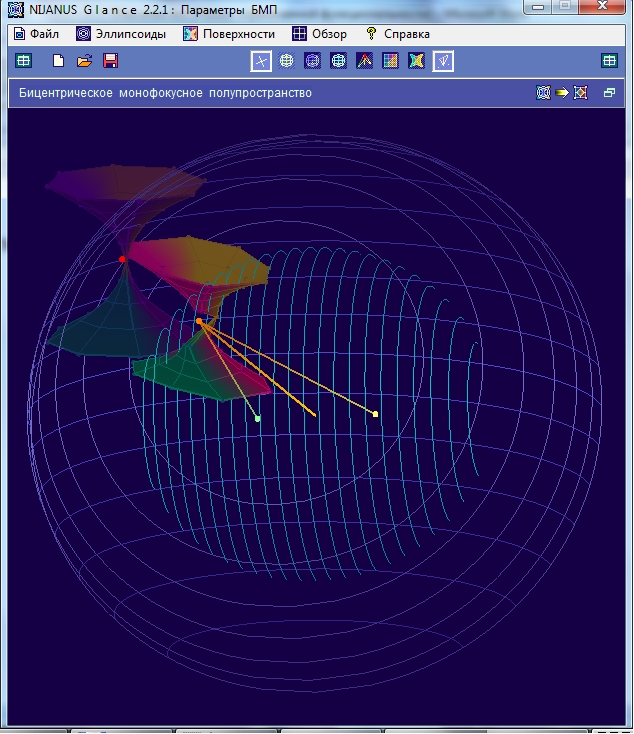
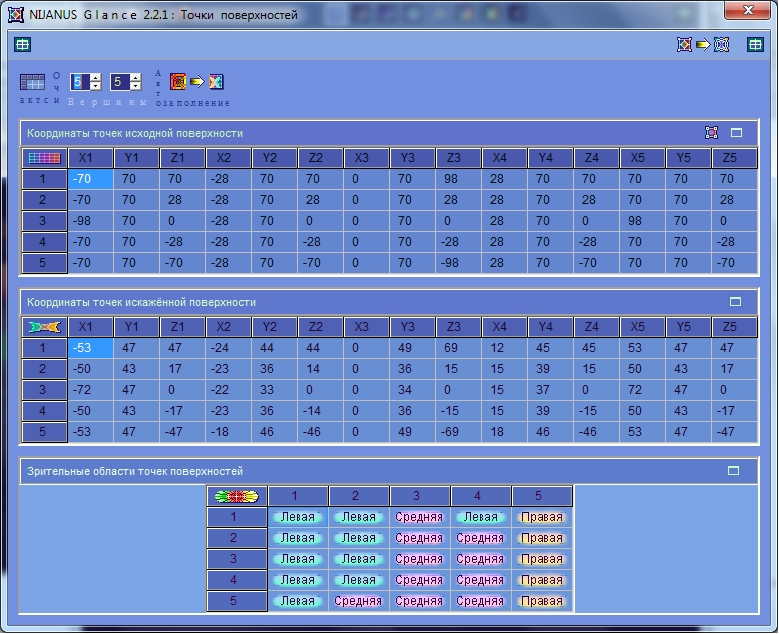
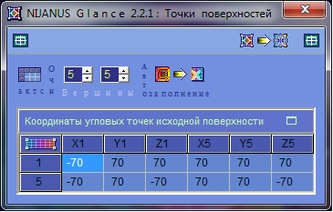
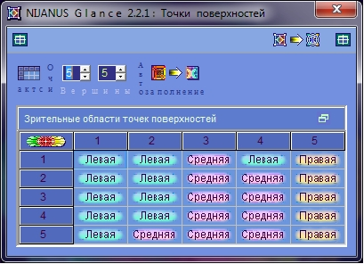
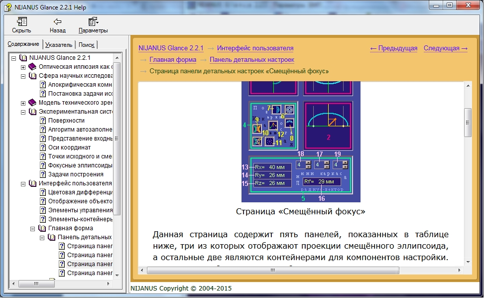

# Приложение для научной работы "Взгляд" (Glance)

## Назначение программы
Это программа, которая моделирует образы человеческого сознания, формирующиеся зрительным восприятием объектов, и показывает взаимные преобразования параметров видимых объектов и образов-результатов восприятия.
Также эта программа моделирует ситуации возникновения зрительных иллюзий и интерпретирует их.
С помощью неё проведено исследование иллюзорно-статического восприятия пространственных объектов, описанное в рамках похода бицентрического монофокусного полупространства.

## Средства разработки
- **Графическая библиотека**: OpenGL.
- **Язык программирования**: Delphi. 
- **Среда разработки**: Borland Delphi 6. 
- **Программа справочной системы**: Microsoft Help Workshop. 
- **Система создания инсталлятора для Windows**: Inno Setup. 

## Актуальность исследования
Актуальность исследования обусловлена расширением научных познаний в области человеческого зрительного восприятия и природы зрительных иллюзий, что может способствовать развитию компьютерной графики, 3D-технологий, голограмм, лазерных проекций, также военных и космических отраслей, связанных с камуфляжем и иллюзорными объектами.
Используются возможности OpenGL. 

## Тема диссертации
Программа выполнена в рамках диссертации на соискание учёной степени кандидата технических наук "Математическое и компьютерное моделирование зрительного восприятия иллюзорных искажённых объектов трёхмерных сцен".
 
## Свидетельство о регистрации программы для ЭВМ

Glance \[Текст\] : свидетельство о гос. регистрации прогр. для ЭВМ № 2014617719 Российская Федерация / Е. А. Котова ; заявитель и правообладатель Федеральное государственное бюджетное образовательное учреждение высшего профессионального образования «Рязанский государственный радиотехнический университет». ― № 2014615257 ; заявл. 03.06.2014 ; зарегистр. в Реестре программ для ЭВМ 31.07.2014. ― 1 с.

## Статус проекта
Проект завершён.

## Контакты
Котова Екатерина Александровна,
e-mail: katekotova_86@mail.ru